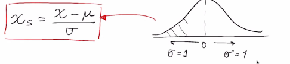

# Curso de Matemáticas para Data Science: Estadística Descriptiva

profesor:**Francisco Camacho**

## Desviación estándar
La desviación estándar es la medida de dispersión más común, que indica qué tan dispersos están los datos con respecto a la media. Mientras mayor sea la desviación estándar, mayor será la dispersión de los datos.
El símbolo σ (sigma) se utiliza frecuentemente para representar la desviación estándar de una población

Un error común es comparar la desviación estándar de dos variables que tienen escalas diferentes, en este ejemplo usaremos el edad y altura

**edad cumplida**

media = 24, desviación estándar = 2.5

**altura en centimentros**

media = 175, desviación estándar = 8

Como vemos la desviación estándar de altura es mayor dado a su escala.

Lo correcto sería usar el **coeficiente de variabilidad** que es simplemente dividir la desviación estandar entre la media.

edad
2.5 / 24 = 0.1042.

altura
8 / 175 = 0.0457

Ahora ambas variables la podemos compara y concluimos que edad tiene una mayor variabilidad


### Distribución normal


para dectectar datos anomalos o outliers que consiste en tomar el primer quantil y le resto 1.5 veces el rango interquantil y luego tomo el 3°er qualtir y le sumo 1.5 veces el rango intercualtir. Ahora el valor resultante sera el valor minimo y el valor maximo
normales sin outliers


**distribuciones no simetricas**:en el caso de una distribucion asimetrica se hace algo parecido a la formula anterior para dectectar los maximos y los minimos normales. la diferencia esta en que se aplica una funcion(f) al quantir Q1 y una funcion (g) al quantir Q3 


## Medidas de dispersión en Python
[Medidas de dispersión](https://deepnote.com/project/curso-estadistica-descriptiva-2021-P1aZSOmoRU-PTaJ6oWEKhw/%2Fplatzi-curso-estadistica-descriptiva-2021%2F%5Bclase-10%5Dmedidas-dispersion.ipynb)
### Asimetría en distribuciones
Como vimos en la clase, el hecho de que nuestra distribución tenga una tendencia a la derecha o a izquierda nos representa un problema, ya que no a acorde con una distribución y eso puede afectar a nuestros análisis si no tomamos en cuenta ese sesgo. No siempre hay que confiar en nuestra intuición o lo que vemos a simple vista, hay métodos como:

* Primer coeficiente de asimetría de Pearson (asimetría de modo)
* Segundo coeficiente de asimetría de Pearson (asimetría mediana)
* Coeficiente de Groeneveld y Meeden
* Coeficiente de Fisher
* Por mencionar algunos.


Y por último, no hay que olvidar la curtosis:
Una curtosis grande implica una mayor concentración de valores de la variable tanto muy cerca de la media de la distribución (pico) como muy lejos de ella (colas), al tiempo que existe una relativamente menor frecuencia de valores intermedios. Esto explica una forma de la distribución de frecuencias/probabilidad con colas más gruesas, con un centro más apuntado y una menor proporción de valores intermedios entre el pico y colas.
Una mayor curtosis no implica una mayor varianza, ni viceversa.
[Curtosis para datos agrupados, curtosis desde un cuadro de frecuencias](https://www.youtube.com/watch?v=gt6bpsGGp44)
## Exploración visual de los datos
la pagina y herramienta [datavizproject](https://datavizproject.com/) ayuda demasiado en la elección del grafico mas adecuado para nuestro analisis.
Esta plataforma [https://www.data-to-viz.com/](https://www.data-to-viz.com/). vienen con los códigos de Python y R necesarios para llevarlos a cabo.
tambien este [link](https://www.youtube.com/watch?v=KorlCl5oFfM) nos muestra el analisis visual de datos 
## Diagramas de dispersión en el análisis de datos
[Diagramas de dispersión](https://deepnote.com/project/curso-estadistica-descriptiva-2021-P1aZSOmoRU-PTaJ6oWEKhw/%2Fplatzi-curso-estadistica-descriptiva-2021%2F%5Bclase-12%5DVisualizaciones.ipynb/#00003-33f86689-6cc4-41c5-abeb-dde3f1a53cc0)

## Pipelines de procesamiento para variables numéricas


### Escalamiento lineal (Normalización)
Llamamos pipeline a una secuencia de procesamiento de datos que permite optimizar mi flujo de trabajo. Estos son comunes en machine learning pues no solo permiten la manipulación y transformación de multiples datos, sino que además tenemos una alta reducción en código. Este consiste en encadenar una serie de estimadores, que me permiten ir trasformando un conjunto de datos en un proceso comprendido por varias etapas de manera secuencial, donde cada componente del pipeline toma los datos, los trasforma y su salida va a la siguiente componente del pipeline, dandose esto hasta pasar por todas las componentes de éste.

**Escalamiento lineal**: es tranformar los datos en otros. Es importante escalar nuestros datos (normalizar) porque los modelos de machine learning utiliza valores escalados ( optimizados ) generalmente de [-1,1]
los escalamientos lineales se usan solo cuando la distribucion de los datos es simetrica o uniformemente distribuida. 

hay varios tipos de escalamientos lineales 

**Escalamiento min - max**: cada dato que tengo, lo transformo en un dato normalizado de tal manera que caigan dentro de este 
intervalo [-1,1]

su formula es la siguiente 


donde:

* 2x: es dos veces el valor de x
*  min: valor minimo
*  max: valor maximo

**Escalamiento clipping**: muy usado pero no recomendable, consiste en tomar la distribucion y cortar la distribucion entre dos valores (corte inferior y corte superior) funciona de la siguiente manera 


suponiendo que los limites son 2.0(limite inferior) y 4.0(limite superior) si tenemos 3.8 lo dejamos igual por estar dentro del rango. pero ahora si tenemos el valor 6.0 lo colazamos al valor del limite superior (4.0). debido a que esta fuera del limite 

este metodo tiene el inconveniente de omitir datos que pueden ser importantes para los modelos de ML

**Escalamiento Z-score**: tengo un conjunto de datos al cual le calculo el promedio y la desviacion estandar su formula es la siguiente 


donde  los valores normalizados son (xs)

* u:promedio
* g:desviacion estandar 

Estadisticamente lo que se hace es convertir la distribucion normal a otra con el promedio en (0) y una desviasion de  1 



lo cual se ajusta al rango [-1,1]

mas sobre escalado de datos [aqui](https://interactivechaos.com/es/manual/tutorial-de-machine-learning/escalado-de-datos)

## Transformación no lineal


la transformacion no lineal lo que hace es transformar una distribucion sesgada a una distribucion simetrica. esto lo hace 
aplicando una funcion como la targente hiperbolica. que al ingresar valores sesgados cercano a cero. la salida de la targente hiperbolica es mover la distribucion, en el grafico la salida despues de aplicar la transformacion es la linea morada  


otra forma es aplicando la raiz cuadrada a la distribucion. Obteniendo resultados parecidos 

**¿Por qué usarlos?**
En el caso donde haya datos fuertemente sesgados y no simétricos.

Algunos tipos:
**Logística**: los valores de la columna se transforman mediante la siguiente fórmula:

log


**LogNormal**: esta opción convierte todos los valores a una escala logarítmica normal. Los valores1 de la columna se transforman mediante la siguiente fórmula:

lognormal
Aquí μ y σ son los parámetros de la distribución, calculados empíricamente a partir de los datos como estimaciones de máxima verosimilitud, para cada columna por separado.


**TanH**: todos los valores se convierten a una tangente hiperbólica. Los valores de la columna se transforman mediante la siguiente fórmula:
Tha
.


¿Cuándo usarlos?
cuando los datos no siguen una distribucion simetrica y/o estan sesgado se aplican una transformacion no lineales que los convertira a una distribucion simetrica y luego aplicamos los escalamientos lineales 


## Procesamiento de datos numéricos en Python
[Procesamiento de datos](https://deepnote.com/project/curso-estadistica-descriptiva-2021-P1aZSOmoRU-PTaJ6oWEKhw/%2Fplatzi-curso-estadistica-descriptiva-2021%2F%5Bclase-15%5DProcesamiento-datos-numericos.ipynb)

La transformación: raw = X[:, None, 2]
Esta transformación puede crear un poco de confusión si no conoces algunos detalles sobre NumPy. Para las dudas te detallo un poco que hizo en esta línea de código.

Note: X tiene un shape de (442, 10) para nuestro estudio solo necesitamos una columna, buscamos tener un raw con shape (442, 1)

: ->  toma todas las columnas y filas.

None -> indica la transformación del arreglo (newaxis)

2 -> Selecciona la 3ra columna de X.

Más información sobre Numpy [Newaxis](https://numpy.org/doc/stable/reference/constants.html#numpy.newaxis)

**nota**: en algunos libros de estadistica la normalizacion Z aparece como estandarizacion de una variable 

reto
para lograr la estandarización con z score encontré tres formas:
la primera aplicando la formula directamente a los datos

```Python
    z_score=(raw -np.mean(raw))/np.std(raw)  #zcore aplicando la formula
```

la segunda usando la libreria de scipy

```Python
    import scipy.stats as stats
    zz_score=stats.zscore(raw)            #zscore usando scipy stats
```

la tercera usando preprocessing de sklearn, para este caso hay que primero asignar el modelo y después “entrenarlo”

```Python
    from sklearn import preprocessing
    z_sc=preprocessing.StandardScaler()
    zzz_score=z_sc.fit_transform(raw)        #zscore usando sklearn preprocessing
```

con todos los casos obtuve el mismo resultado


los tiempos para cada caso
Screenshot 2021-06-24 201928.jpg
## Pipelines de Procesamiento para Variables Categorica
Cuando se tiene variables categóricas se hace un mapeo numérico. Para eso hay 2 métodos, de manera que sean fácilmente interpretables en modelos de machine learning:

**Dummy** : es la representación más compacta que se puede tener de los datos. Es mejor usarla cuando los inputs son variables linealmente independientes (no tienen un grado de correlación significativo). Es decir, las cuando se sabe que las categorías son independientes entre sí.

**One-hot** : es más extenso. Permite incluir categorías que no estaban en el dataset inicialmente. De forma que si se filtra una categoría que no estaba incluida, igual se pueda representar numéricamente y no de error en el modelo (este modelo es más cool y es el que se usa).

Hay errores en la notación de Pandas y los tratan como que ambos modelos son lo mismo, pero en la realidad el Dummy no se usa. Aún así, en Pandas el método es .get_dummies().

## Procesamiento para Variable Categorica con Python
[Procesamiento para Variable Categorica con Python](https://deepnote.com/project/curso-estadistica-descriptiva-2021-P1aZSOmoRU-PTaJ6oWEKhw/%2Fplatzi-curso-estadistica-descriptiva-2021%2F%5Bclase-17%5DProcesamiento-datos-categoricos.ipynb)

[documentación](https://scikit-learn.org/stable/modules/preprocessing.html#encoding-categorical-features)
## Correlaciones

**¿Qué es la correlación?**
La correlación es una medida estadística que expresa hasta qué punto dos variables están relacionadas linealmente (esto es, cambian conjuntamente a una tasa constante).

**¿Qué es la covarianza?**
Es un valor que indica el grado de variación conjunta de dos variables aleatorias respecto a sus medias.


**¿Qué es el coeficiente de correlación?**
El coeficiente de correlación es la medida específica que cuantifica la intensidad de la relación lineal entre dos variables en un análisis de correlación.


Correlación gráficamente [aqui](https://rpsychologist.com/correlation/):


> Siempre debemos considerar que: Correlación no implica causalidad.

Si desean profundizar sobre la definicion del coeficiente de correlacion, les recomiendo leer a partir de la pagina 147 de [este libro]( https://cims.nyu.edu/~cfgranda/pages/stuff/probability_stats_for_DS.pdf)

que fue uno de los libros guía para el curso.

### Dato curioso:
Lo que meciona Pacho al inicio de la clase, en econometría se le conoce como multicolinealidad que es una situación en la que se presenta una fuerte correlación entre variables del modelo.

Hay 2 tipos de multicolinealidad:

**Multicolinealidad exacta**: Hay colinealidad exacta, cuando una o más variables, son una combinación lineal de otra, es decir, existe un coeficiente de correlación entre estas dos variables de 1.

**Multicolinealidad aproximada**: Hay colinealidad aproximada, cuando una o más variables, no son exactamente una combinación lineal de la otra, pero existe un coeficiente de determinación entre estas variables muy cercano al uno.

## Matriz de Covarianza
[Matriz de Covarianza](https://deepnote.com/project/curso-estadistica-descriptiva-2021-P1aZSOmoRU-PTaJ6oWEKhw/%2Fplatzi-curso-estadistica-descriptiva-2021%2F%5Bclase-19%5Dmatriz-covarianza.ipynb)

Una matriz de varianzas-covarianzas es una matriz cuadrada que contiene las varianzas y covarianzas asociadas con diferentes variables. Los elementos de la diagonal de la matriz contienen las varianzas de las variables, mientras que los elementos que se encuentran fuera de la diagonal contienen las covarianzas entre todos los pares posibles de variables.


por si a alguien tiene la inquietud de cómo se haría con pandas (dataframes en lugar de arrays)

**Normalizamos**

```Python
	scaler = StandardScaler()
	scaled = scaler.fit_transform(
    		iris[['sepal_length', 'sepal_width', 'petal_length', 'petal_width']]
	)
```
** pasamos a dataframe**

```Python
	scaled_df=pd.DataFrame(scaled)
```

**matriz de Covarianza y matriz de correlación**

```Python
covar=scaled_df.cov()
correlacion_matrix_pd=scaled_df.corr()
vizualizamos matriz de correlación

hm=sns.heatmap(correlacion_matrix_pd,
                annot=True,
                cmap="RdBu",
                vmin=-1.0,
                yticklabels=['sepal_length', 'sepal_width', 'petal_length', 'petal_width'],
                xticklabels=['sepal_length', 'sepal_width', 'petal_length', 'petal_width']
                )
```


Para evitar tener que transponer la matriz podemos usar la opción ´rowvar´

```Python
	covariance_matrix = np.cov(scaled, rowvar=False)
```

Con la librería pandas puedes utilizar las siguientes dos métodos:

**Matriz covarianza** 

```Python
matriz.cov()
```

**Matriz correlación**

```Python
matriz .corr()
```

Y según yo nos evitamos tantas líneas de código.
## PROYECTO DE APLICACION

## Cálculo de valores propios de una matriz

### Lectura

Como viste en la clase anterior, cuando tenemos un conjunto de datos con muchas variables, la matriz de covarianza es el objeto matemático que permite identificar cuáles variables están altamente correlacionadas.

Cuando dos variables están altamente correlacionadas, quiere decir que aportan básicamente la misma información del problema y eso podría indicar que solo necesitaríamos una sola de ellas. En la próxima clase veremos que esa reducción de variables se puede hacer con una técnica matemática denominada PCA (principal component analysis).

Esta técnica está basada en un concepto del álgebra de vectores y matrices, que llamamos el cálculo de los valores propios de una matriz, y en esta lectura profundizaremos sobre qué significa ese procedimiento.

### Repaso de matrices
Las matrices en general son objetos matemáticos que tienen un cierto número de filas y columnas (estos números los denominamos dimensiones de la matriz).

Las matrices tienen una operación especial, que llamamos transponer, la cual consiste en ubicar cada fila como una columna en una nueva matriz, el resultado de una transposición se denomina matriz transpuesta y se ve así:


Así también, entre las matrices podemos definir reglas de suma y resta de forma similar a como hacemos con los números naturales o decimales, con una condición especial: ambas matrices deben tener las mismas dimensiones y cuando las dimensiones de una matriz son iguales entre ellas (**# filas = # columnas**) decimos que la matriz es cuadrada.

Con esto en mente resumimos lo anterior con un ejemplo de suma entre dos matrices cuadradas así:


Ahora bien, las matrices también tienen una operación de multiplicación entre ellas que es más compleja de definir que la suma, sin embargo aquí vamos a desglosarla. Vamos a reemplazar los elementos numéricos de las matrices del ejemplo anterior por variables algebraicas, indicando que pueden ser cualquier número para así exponer el proceso con la mayor generalidad posible. De esta manera, vamos a definir el producto de dos matrices cuadradas de tal manera que el resultado sea otra matriz de las mismas dimensiones así:


Donde cada expresión algebraica tiene la forma de dos índices que denotan la fila y columna donde está posicionado el número, respectivamente. Y la manera de calcular cada elemento de la matriz resultante viene dado por una regla sencilla que ilustraremos con el siguiente ejemplo:


Veamos otro ejemplo para tenerlo más claro:


En python el producto de matrices se calcula fácil usando la librería numpy:

```Python
np.matmul(A, B)
```

## PCA: análisis de componentes principales
[deepnote](https://deepnote.com/project/curso-estadistica-descriptiva-2021-P1aZSOmoRU-PTaJ6oWEKhw/%2Fplatzi-curso-estadistica-descriptiva-2021%2F%5Bclase-22%5DPCA.ipynb)

print(variance_explained)
[72.9624454132999, 22.850761786701725, 3.6689218892828612, 0.5178709107154993]

**interpretacion**

el primer componetente captura el 72.9 % de la varianza total de las 4 dimensiones , el segundo componente captura el 22.8 % de varianza 

## Resumen del Curso 
la estadistica descriptiva tiene dos visiones fundamentales resumir informacion con numeros (desviacion estandar , promedio, varianza, quartiles) y tmbien resumir informacion con visualizaciones, tambien la estadistica descriptiva como una herramienta de analisis nos permite trabajar en dos bloques fundamentales (analisis exploratorio de la informacion y procesamiento de la informacion antes de tener un modelo de machine learning) es importante porque en la vida real encontraras datos crudos que pueden contener datos numericos, categoricos y tienes que hacer transformaciones sobre los numeros y sobre las categorias para que todo tenga un formato estandarizado y homogeneo que sea de facil entendimiento para un modelo de ML

en tendemos por tanto que el concepto de correlaciones es fundamental y la usamos para visualizar que variables tienen una alta relacion unas con otras y de hay podemos ver que hay variables que pueden resultar dedundantes para darselas como input como modelo predictivo o de clasificacion 

por tanto la idea del curso es saber lo minimo de estadistica que permita transformar datos crudos hasta la prediccion y uso de un modelo 

----------------

Visión de la estadística descriptiva: Resumir información con números y con visualizaciones

La estadística descriptiva nos permite trabajar con 2 bloques fundamentales de la ciencia de datos:

El análisis exploratorio de datos y en el procesamiento de la información, antes de pasar al modelo de Machine Learning.
¿Por qué es tan importante el procesamiento de datos? El procesamiento de datos es muy importante para que todo tenga un formato estandarizado para que sea de fácil entendimiento para un modelo de Machine Learning. Sabiendo eso, las correlaciones son fundamentales para ver que variables tienen una alta relación y de ahí evidenciar que puede haber variables que pueden resultan redundantes para el modelo

Y como conclusión final vimos la técnica PCA: el análisis de componentes principales es una técnica utilizada para describir un conjunto de datos en términos de nuevas variables no correlacionadas.


### Referencias 

Notas de Anthony Ismael Manotoa Moreno

[Notas utiles](https://deepnote.com/@anthonymanotoa/Apuntes-de-Estadistica-Descriptiva-z6iCtsB_Q_6ZARwuRxzhIA)

Notas de Lizandro José Ramírez Difo
[Notas utiles](https://github.com/difo23/curso-platzi-estadisticas-descriptivas)

